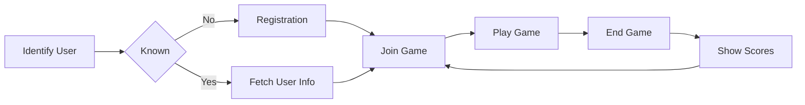

# whack-a-mole

```mermaid
flowchart LR
    A[Identify User] --> B{Known};
    B -- No --> C[Registration]
    B -- Yes --> D[Fetch User Info]
    C --> E[Join Game]
    D --> E
    E --> F[Play Game]
    F --> G[End Game]
    G --> H[Show Scores]
    H --> E
```
