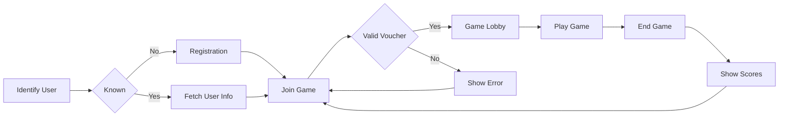

# Whack - A - Mole Game

This is a whack-a-mole game created for conferences. The purpose of this game is to demonstrate the use of container technology to be able to scale up and down rapidly, allowing to handle peaks on workloads extremely well.

This repository contains the front-end implementation of the game, of which the flow looks like this:

## Game flow

When the user enters the game URL, the game tries to identify whether or not this user has already registered before. If not, the front-end requests for new user registration. Basically a display name and email (optional) is requested. Then the user can enter a certain game. Games are created and controlled from a backend system that is not included in this front-end solution.

Optionally, users enter a voucher code to ensure a one-time unique ability to join games. When all is fine, the user ends up in the game lobby waiting for the game to start. Once the game has started, no user can join the game anymore.

For 30 seconds, moles randomly appear on a 3 x 3 grid. The user (player) must whack moles as soon as possible whenever a mole appears. The game measures the time it takes for the player to whack a mole whenever it appears (less is better). In the end, the player with at least 20 moles whacked, and the best average time is the winner.

After 30 seconds, the game ends and advances to the Game End screen where the winner of the game is shown. The user can loop back to the Join Game screen to join a new game\*.

## Additional controls and rules

Games can be created, activated and started in a central backend system. This system does not have a front-end representation in this project. Games are started in a central system and thus all playes that joined the same game, are playing together at the same time.

\* If vouchers are required, the user can only join a new game when he has a new -valid- voucher available.
